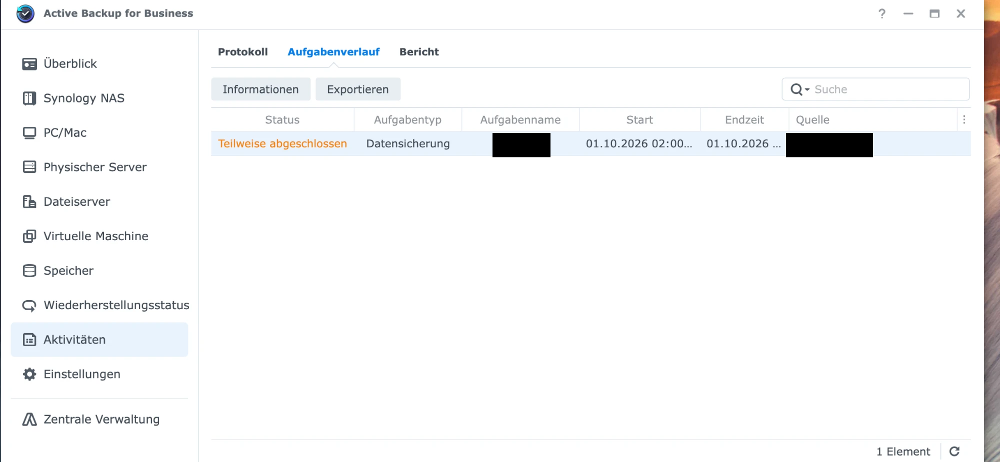
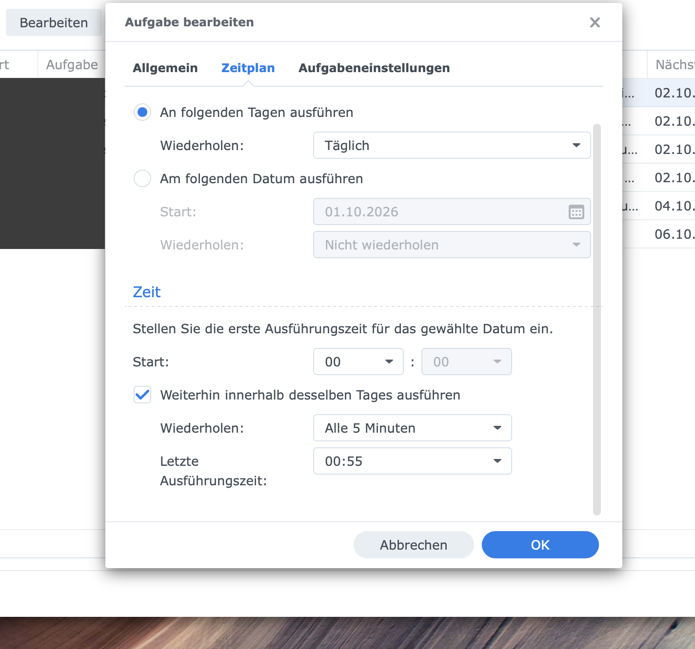

# Installationsanleitung

🇬🇧 [English Version](INSTALL.md)

Für die automatische Einrichtung: `sudo ./install.sh`. Diese Anleitung beschreibt die manuelle Installation.

---

## Überblick

Das Monitoring besteht aus zwei Teilen:

1. **Synology NAS** — exportiert ABB-Daten aus SQLite als CSV (alle 5 Minuten)
2. **Zabbix Proxy/Server** — liest die CSV-Dateien via NFS und liefert Daten an Zabbix

---

## Schritt 1: NFS-Freigabe (Synology)

1. **DSM → Systemsteuerung → Gemeinsamer Ordner** → `monitoring` erstellen
2. **DSM → Systemsteuerung → Dateidienste → NFS** → NFS aktivieren
3. **Gemeinsamer Ordner → Bearbeiten → NFS-Berechtigungen**:
   - Client: `<zabbix-proxy-ip>`
   - Berechtigung: **Nur Lesen**
   - Squash: **Alle Benutzer zu Admin zuordnen**

Die Freigabe ist danach unter `<nas-ip>:/volume1/monitoring` erreichbar.

---

## Schritt 2: Synology-Skripte

Per SSH auf die NAS als `admin` verbinden.

### Skripte kopieren

```bash
sudo mkdir -p /volume1/monitoring/scripts /volume1/monitoring/abb
sudo cp synology/abb_export.sh synology/abb_daily_summary.sh /volume1/monitoring/scripts/
sudo chmod 755 /volume1/monitoring/scripts/abb_*.sh
```

### Voraussetzungen prüfen

```bash
which sqlite3                           # → /usr/bin/sqlite3
ls /volume1/@ActiveBackup/activity.db   # muss vorhanden sein
```

### Testen

```bash
sudo /volume1/monitoring/scripts/abb_export.sh
head -2 /volume1/monitoring/abb/ActiveBackupExport.csv
```

Erwartet: 7 Spalten inklusive `LAST_SUCCESS_TS`.

### Geplante Aufgaben in DSM einrichten

**DSM → Systemsteuerung → Aufgabenplaner**

#### Aufgabe 1: ABB Export (alle 5 Minuten)

1. **Erstellen → Geplante Aufgabe → Benutzerdefiniertes Skript**
2. Tab **Allgemein**:
   - Aufgabe: `ABB Export`
   - Benutzer: **root**
   - Aktiviert: ✅
3. Tab **Zeitplan**:
   - An folgenden Tagen ausführen: **Täglich**
   - Häufigkeit: **Alle 5 Minuten**
   - Erste Ausführungszeit: `00:00`
   - Letzte Ausführungszeit: `23:55`
4. Tab **Aufgabeneinstellungen** → Benutzerdefiniertes Skript:

```
/volume1/monitoring/scripts/abb_export.sh
```

#### Aufgabe 2: ABB Tageszusammenfassung (einmal täglich)

1. **Erstellen → Geplante Aufgabe → Benutzerdefiniertes Skript**
2. Tab **Allgemein**:
   - Aufgabe: `ABB Daily Summary`
   - Benutzer: **root**
   - Aktiviert: ✅
3. Tab **Zeitplan**:
   - An folgenden Tagen ausführen: **Täglich**
   - Häufigkeit: einmal am Tag, Zeit: `23:55`
4. Tab **Aufgabeneinstellungen** → Benutzerdefiniertes Skript:

```
/volume1/monitoring/scripts/abb_daily_summary.sh
```

#### Aufgabe testen

Aufgabe markieren → **Ausführen** klicken. Danach prüfen:

```bash
head -2 /volume1/monitoring/abb/ActiveBackupExport.csv
```

Sollte 7 Spalten zeigen mit `LAST_SUCCESS_TS` als letzter Spalte.

> ⚠️ **Upgrade-Hinweis:** Falls du eine ältere Version benutzt hast — die separate „Enhance"-Aufgabe (`abb_export_enhance_last_success.sh`) kann gelöscht werden. Export und Anreicherung sind jetzt in einem Skript kombiniert.

---

## Schritt 3: NFS-Mount (Zabbix Proxy)

### Test-Mount

```bash
sudo mkdir -p /mnt/synology/monitoring
sudo mount -t nfs <nas-ip>:/volume1/monitoring /mnt/synology/monitoring -o ro,soft,timeo=10
ls /mnt/synology/monitoring/abb/
```

### Permanenter Mount

In `/etc/fstab` eintragen:

```
<nas-ip>:/volume1/monitoring  /mnt/synology/monitoring  nfs  ro,soft,timeo=10,_netdev  0  0
```

Oder **autofs** für On-Demand-Mounting:

```bash
sudo apt install autofs

# /etc/auto.master.d/synology.autofs
/mnt/synology  /etc/auto.synology  --timeout=300

# /etc/auto.synology
monitoring  -fstype=nfs,ro,soft,timeo=10  <nas-ip>:/volume1/monitoring
```

---

## Schritt 4: Zabbix-Skripte

```bash
sudo cp zabbix/abb.sh zabbix/abb-enh.sh /usr/lib/zabbix/externalscripts/
sudo chmod 755 /usr/lib/zabbix/externalscripts/abb*.sh
sudo chown root:zabbix /usr/lib/zabbix/externalscripts/abb*.sh
```

### Testen

```bash
# Als root
/usr/lib/zabbix/externalscripts/abb.sh device_count
/usr/lib/zabbix/externalscripts/abb.sh json | python3 -m json.tool | head -20

# Als zabbix-Benutzer (entscheidend!)
sudo -u zabbix /usr/lib/zabbix/externalscripts/abb.sh json | head -c 200
sudo -u zabbix /usr/lib/zabbix/externalscripts/abb.sh check 900 /mnt/synology/monitoring

# Debug-Modus
ABB_DEBUG=1 sudo -u zabbix /usr/lib/zabbix/externalscripts/abb.sh check 900 /mnt/synology/monitoring
```

---

## Schritt 5: Zabbix-Template

### Importieren

**Zabbix UI → Datenerfassung → Templates → Importieren** → `template/Synology-ABB-Zabbix-Check.xml` auswählen → **Importieren**

### Dem Host zuweisen

**Datenerfassung → Hosts → (dein Host) → Templates → Neues Template verknüpfen** → `Synology Active Backup` suchen → **Aktualisieren**

### Makros anpassen

Host → **Makros** → **Geerbte und Host-Makros** → nach Bedarf überschreiben (siehe [README.de.md](README.de.md#template-makros)).

### Trigger-Abhängigkeiten setzen (empfohlen)

**Templates → Synology ABB… → Trigger** → jeden Trigger → **Abhängigkeiten** → `ABB: Export script or mount not OK` hinzufügen

---

## Schritt 6: Überprüfen

1. 5–10 Minuten warten
2. **Monitoring → Aktuelle Daten** → nach Host filtern → `ABB Raw JSON data` sollte einen Wert haben
3. Alle abhängigen Items werden automatisch befüllt
4. Nach ca. 1 Stunde läuft die Discovery und Geräte-Items erscheinen
5. **Dashboards → ABB Monitoring** für die Übersicht

Die ABB-Aufgaben selbst (DSM → Active Backup for Business → Aktivitäten) zeigen den Status, den dieses Monitoring erfasst und nach Zabbix bringt — z. B. „Teilweise abgeschlossen":



---

## Fehlerbehebung

| Symptom | Ursache | Lösung |
|---------|---------|--------|
| JSON-Item leer | CSV nicht lesbar für zabbix | NFS-Mount + Dateirechte prüfen |
| `check` liefert 1 | Mount nicht verfügbar oder CSV veraltet | Export auf NAS ausführen, NFS prüfen |
| `last_success_ts` = 0 | Altes Export-Skript (6 Spalten) | Neues `abb_export.sh` auf NAS deployen |
| Discovery findet keine Geräte | JSON-Master leer | Erst JSON-Item reparieren |
| Alle Geräte „Unknown" (99) | DEVICEID stimmt nicht | CSV-Format prüfen |
| Template-Import schlägt fehl | Zabbix zu alt | 6.4+ mit JS-Preprocessing erforderlich |
| Export läuft nur ~1 h/Tag, dann CSV veraltet (`check` wird „Problem") | DSM-Aufgabe: „Letzte Ausführungszeit" zu früh gesetzt (z. B. `00:55`) → Export stoppt nach dem Fenster, 23 h still | Im Aufgabenplaner → Aufgabe bearbeiten → Zeitplan: **„Letzte Ausführungszeit" auf `23:55`** (Start `00:00`, alle 5 Min) |

**Beispiel der Zeitfenster-Falle** — „Letzte Ausführungszeit" steht auf `00:55` statt `23:55`. Der Export läuft dann nur von 00:00 bis 00:55 und steht die restlichen 23 h still:



---

## Deinstallation

```bash
sudo ./install.sh --uninstall
```

Oder manuell:

```bash
# Zabbix-Proxy
sudo rm /usr/lib/zabbix/externalscripts/abb.sh /usr/lib/zabbix/externalscripts/abb-enh.sh

# Synology: Geplante Aufgaben in DSM entfernen, dann:
sudo rm /volume1/monitoring/scripts/abb_export.sh /volume1/monitoring/scripts/abb_daily_summary.sh
```

Das Template in der Zabbix-UI separat entfernen.
