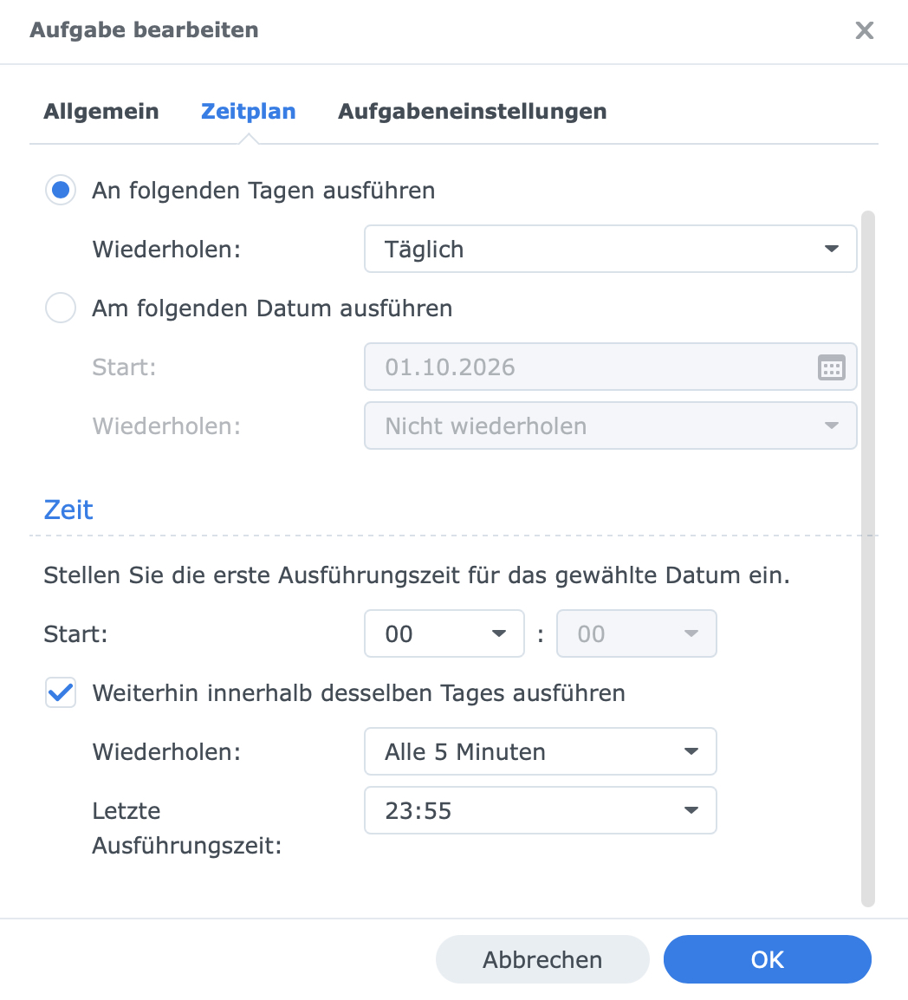
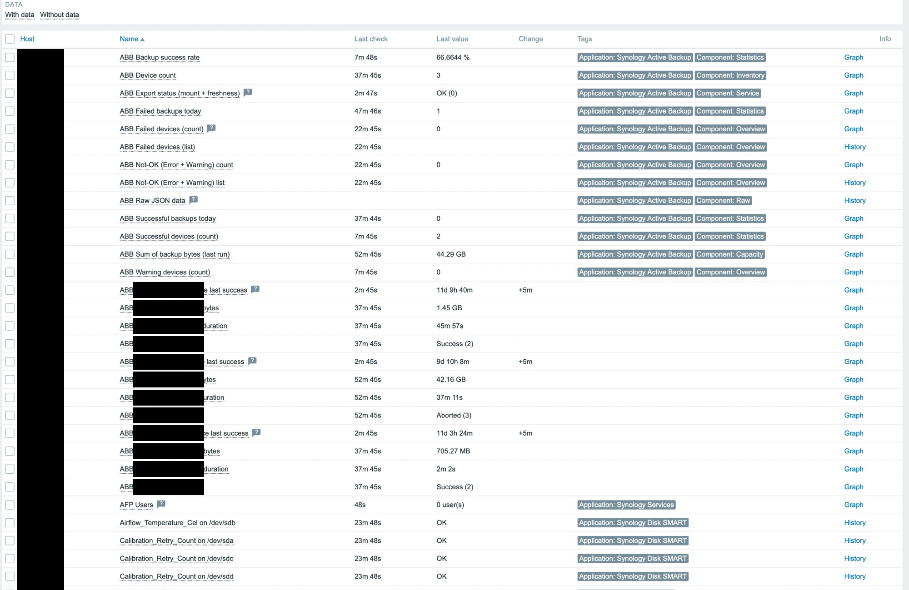

# Installation Guide

🇩🇪 [Deutsche Version](INSTALL.de.md)

For automated setup, run `sudo ./install.sh`. This guide covers manual installation.

---

## Overview

The monitoring stack has two halves:

1. **Synology NAS** — exports ABB data from SQLite to CSV every 5 minutes
2. **Zabbix Proxy/Server** — reads CSV files via NFS and feeds data into Zabbix

---

## Step 1: NFS Share (Synology)

1. **DSM → Control Panel → Shared Folder** → Create `monitoring`
2. **DSM → Control Panel → File Services → NFS** → Enable NFS
3. **Shared Folder → Edit → NFS Permissions**:
   - Client: `<zabbix-proxy-ip>`
   - Privilege: **Read Only**
   - Squash: **Map all to admin**

The share will be available as `<nas-ip>:/volume1/monitoring`.

---

## Step 2: Synology Scripts

SSH into the NAS as `admin`.

### Copy scripts

```bash
sudo mkdir -p /volume1/monitoring/scripts /volume1/monitoring/abb
sudo cp synology/abb_export.sh synology/abb_daily_summary.sh /volume1/monitoring/scripts/
sudo chmod 755 /volume1/monitoring/scripts/abb_*.sh
```

### Verify prerequisites

```bash
which sqlite3                           # → /usr/bin/sqlite3
ls /volume1/@ActiveBackup/activity.db   # must exist
```

### Test

```bash
sudo /volume1/monitoring/scripts/abb_export.sh
head -2 /volume1/monitoring/abb/ActiveBackupExport.csv
```

Expected: 7 columns including `LAST_SUCCESS_TS`.

### Set up scheduled tasks in DSM

**DSM → Control Panel → Task Scheduler**

#### Task 1: ABB Export (every 5 minutes)

1. **Create → Scheduled Task → User-defined Script**
2. **General** tab:
   - Task: `ABB Export`
   - User: **root**
   - Enabled: ✅
3. **Schedule** tab:
   - Run on the following days: **Daily**
   - Frequency: **Every 5 minutes**
   - First run time: `00:00`
   - Last run time: `23:55`
4. **Task Settings** tab → User-defined script:

```
/volume1/monitoring/scripts/abb_export.sh
```

The Schedule tab should look like this — important: **Last run time `23:55`** (not earlier, otherwise the export only runs until then and sits idle the rest of the day):



#### Task 2: ABB Daily Summary (once per day)

1. **Create → Scheduled Task → User-defined Script**
2. **General** tab:
   - Task: `ABB Daily Summary`
   - User: **root**
   - Enabled: ✅
3. **Schedule** tab:
   - Run on the following days: **Daily**
   - Frequency: once per day, Time: `23:55`
4. **Task Settings** tab → User-defined script:

```
/volume1/monitoring/scripts/abb_daily_summary.sh
```

#### Test the task

Select the task → click **Run**. Then verify:

```bash
head -2 /volume1/monitoring/abb/ActiveBackupExport.csv
```

Should show 7 columns with `LAST_SUCCESS_TS` as the last column.

> ⚠️ **Upgrade note:** If upgrading from a previous version, remove the separate "enhance" task (`abb_export_enhance_last_success.sh`). Export and enrichment are now combined in one script.

---

## Step 3: NFS Mount (Zabbix Proxy)

### Test mount

```bash
sudo mkdir -p /mnt/synology/monitoring
sudo mount -t nfs <nas-ip>:/volume1/monitoring /mnt/synology/monitoring -o ro,soft,timeo=10
ls /mnt/synology/monitoring/abb/
```

### Persistent mount

Add to `/etc/fstab`:

```
<nas-ip>:/volume1/monitoring  /mnt/synology/monitoring  nfs  ro,soft,timeo=10,_netdev  0  0
```

Or use **autofs**:

```bash
sudo apt install autofs

# /etc/auto.master.d/synology.autofs
/mnt/synology  /etc/auto.synology  --timeout=300

# /etc/auto.synology
monitoring  -fstype=nfs,ro,soft,timeo=10  <nas-ip>:/volume1/monitoring
```

---

## Step 4: Zabbix Scripts

```bash
sudo cp zabbix/abb.sh zabbix/abb-enh.sh /usr/lib/zabbix/externalscripts/
sudo chmod 755 /usr/lib/zabbix/externalscripts/abb*.sh
sudo chown root:zabbix /usr/lib/zabbix/externalscripts/abb*.sh
```

### Test

```bash
# As root
/usr/lib/zabbix/externalscripts/abb.sh device_count
/usr/lib/zabbix/externalscripts/abb.sh json | python3 -m json.tool | head -20

# As zabbix user (critical!)
sudo -u zabbix /usr/lib/zabbix/externalscripts/abb.sh json | head -c 200
sudo -u zabbix /usr/lib/zabbix/externalscripts/abb.sh check 900 /mnt/synology/monitoring

# Debug mode
ABB_DEBUG=1 sudo -u zabbix /usr/lib/zabbix/externalscripts/abb.sh check 900 /mnt/synology/monitoring
```

---

## Step 5: Zabbix Template

### Import

**Zabbix UI → Data collection → Templates → Import** → select `template/Synology-ABB-Zabbix-Check.xml` → **Import**

### Assign to host

**Data collection → Hosts → (your host) → Templates → Link new template** → search `Synology Active Backup` → **Update**

### Adjust macros

Host → **Macros** → **Inherited and host macros** → override as needed (see [README.md](README.md#template-macros)).

### Set trigger dependencies (recommended)

**Templates → Synology ABB… → Triggers** → each trigger → **Dependencies** → add `ABB: Export script or mount not OK`

---

## Step 6: Verify

1. Wait 5–10 minutes
2. **Monitoring → Latest data** → filter by host → `ABB Raw JSON data` should have a value
3. All dependent items will populate automatically
4. After ~1 hour, LLD runs and per-device items appear
5. **Dashboards → ABB Monitoring** for the overview

Under **Monitoring → Latest data** the ABB items appear (overview, statistics, service status) along with the per-device items found by discovery:



The ABB tasks themselves (DSM → Active Backup for Business → Activities) show the status this monitoring captures and forwards to Zabbix — e.g. "Partially completed":


---

## Troubleshooting

| Symptom | Cause | Fix |
|---------|-------|-----|
| JSON item empty | CSV not readable by zabbix | Check NFS mount + file permissions |
| `check` returns 1 | Mount down or CSV stale | Run export on NAS, verify NFS |
| `last_success_ts` = 0 | Old export script (6 columns) | Deploy new `abb_export.sh` on NAS |
| Discovery finds no devices | JSON master empty | Fix JSON item first |
| All devices "Unknown" (99) | DEVICEID mismatch | Check CSV format |
| Template import fails | Zabbix too old | Requires 6.4+ with JS preprocessing |
| Export runs only ~1 h/day, then CSV goes stale (`check` turns "Problem") | DSM task: "Last run time" set too early (e.g. `00:55`) → export stops after the window, idle 23 h | Task Scheduler → edit task → Schedule: **set "Last run time" to `23:55`** (start `00:00`, every 5 min) |

**Example of the time-window trap** — "Last run time" set to `00:55` instead of `23:55`. The export then only runs from 00:00 to 00:55 and sits idle for the remaining 23 h:


---

## Uninstall

```bash
sudo ./install.sh --uninstall
```

Or manually:

```bash
# Zabbix proxy
sudo rm /usr/lib/zabbix/externalscripts/abb.sh /usr/lib/zabbix/externalscripts/abb-enh.sh

# Synology: remove scheduled tasks in DSM, then:
sudo rm /volume1/monitoring/scripts/abb_export.sh /volume1/monitoring/scripts/abb_daily_summary.sh
```

Remove the template from the Zabbix UI separately.
